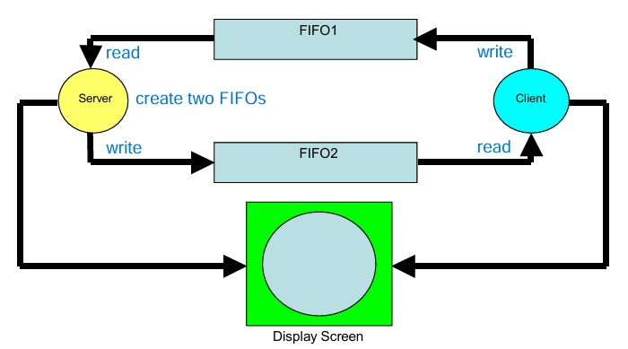

# Inter-Process Communication Using FIFOs (Named Pipes)

## Overview
This project demonstrates inter-process communication (IPC) using **named pipes (FIFOs)** in Linux. It implements a simple client-server model:

- **Server**
  - Creates two FIFOs:
    - `FIFO1` for reading messages from the client.
    - `FIFO2` for sending/writing replies to the client.

- **Client**
  - Writes a message to `FIFO1`.
  - Reads the server's reply from `FIFO2`.

Both server and client display the messages exchanged and then terminate.




## Compilation & Execution
```sh
gcc server.c -o server
gcc client.c -o client

# Run server in the background
./server &

# Run client
./client
```

> `&` runs the server process in the background so the same terminal can be used to start the client.  
> Use `ps` to verify the server is running.


## PIPE vs. FIFO
- **Pipe (Unnamed Pipe)**
  - Uses an in-memory buffer.
  - Does **not** require explicit opening.
  - Used for communication between **related processes** (e.g., parent-child).
  - Created using the `pipe()` system call.
- **FIFO (Named Pipe)**
  - Exists as a special file in the filesystem.
  - Requires **explicit creation and opening**.
  - Used for communication between **related or unrelated processes**.
  - Created using the `mknod()` system call, `mkfifo()` C library call, `mkfifo` from terminal.
  - ```sh
    #include <sys/types.h> 
    #include <sys/stat.h>

    # mode: S_IFIFO | permissions,  dev: 0
    int mknod(const char *path, mode_t mode, dev_t dev);
    int mkfifo(const char *path, mode_t mode);

    # &: Run this process in background.
    # tee: Takes input from stdin, write data into file and stdout.
    # mkfifo to create named pipe for IPC b/w related/unrelated processes.
    mkfifo fifo1
    man ls > ls.dat
    cat ls.dat | grep ls | wc -l &, sort < ls.dat | tee fifo1 | wc
    ```

# `open()` System Call
```sh
#include <sys/types.h> 
#include <sys/stat.h> 
#include <fcntl.h> 

// Basic usage
int open(const char *pathname, int flags);

// With permissions (e.g., when using O_CREAT)
int open(const char *pathname, int flags, mode_t mode);
```

> Common Flags: O_RDONLY, O_WRONLY, O_RDWR, O_NDELAY (or O_NONBLOCK), O_APPEND, O_CREAT

## Author
**Muhammad Ismail**  
🌐 Website: [ismailfaridi.com](https://ismailfaridi.com)  
💼 LinkedIn: [linkedin.com/in/ismailfaridi](https://www.linkedin.com/in/ismailfaridi/)